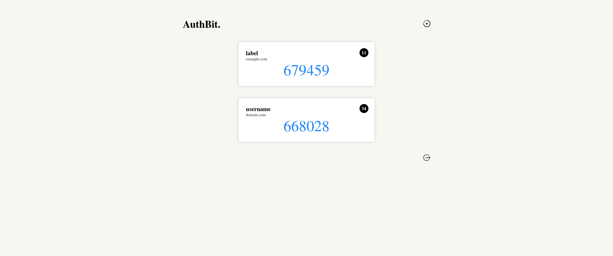

# AuthBit.

Web-based OTP authenticator

## Technologies

AuthBit is built with: 
 - [otpauth](https://github.com/hectorm/otpauth) library to generate OTP code online
 - [javascript-blowfish](https://github.com/javascript-blowfish) library to encrypt and decrypt data using Blowfish algorithms

## Security
Your secret key will be encrypted. And all your data is stored locally. 
You can fork this repository and self-hosted AuthBit and use it even when you're offline.
I can't be sure it's 100 % safe, so **USE IT AT YOUR OWN RISK.**

## Credit
 - Thank to [Flaticon](https://flaticon.com) for their nice icons.
 - Inspire by [otp-authenticator-webapp](https://github.com/qoomon/otp-authentcator-webapp) by @qoomon

